## Find Contours Function
- Implementating cv2.findContours(image, cv2.RETR_EXTERNAL, cv2.CHAIN_APPROX_NONE) function manually.
- it's ben written for the extrenal & list modes.
  - Original image:
    >  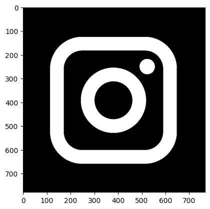

  - RETR_EXTERNAL:
    > 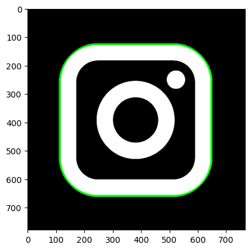
  - RETR_LIST:
    > 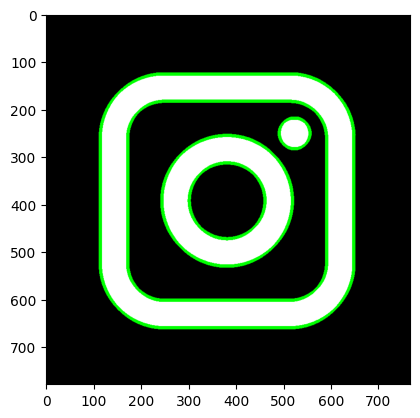

## Dice score detection
- Find the score of dices using **opencv** methodes(canny, threshold, close morphology, HoughCircles and etc).
>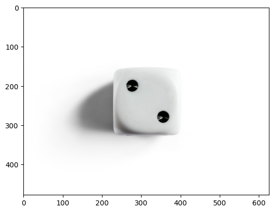

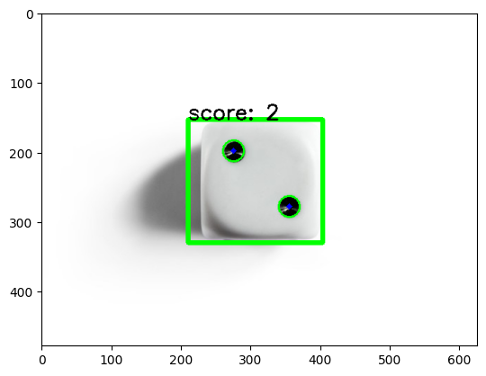

>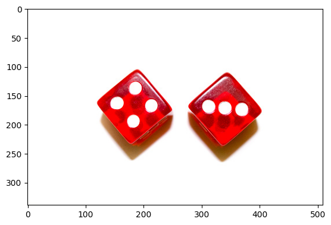

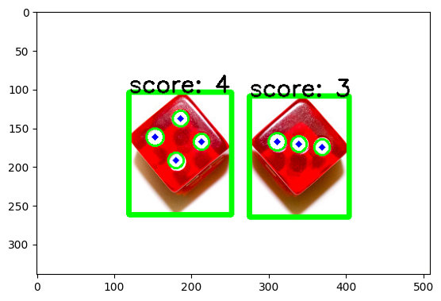

> 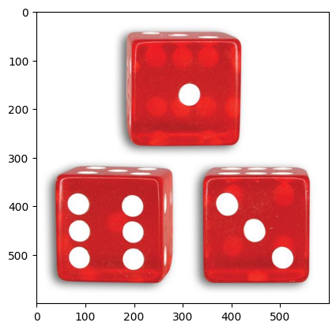

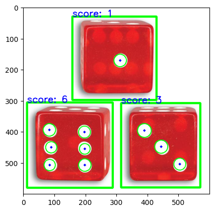

> 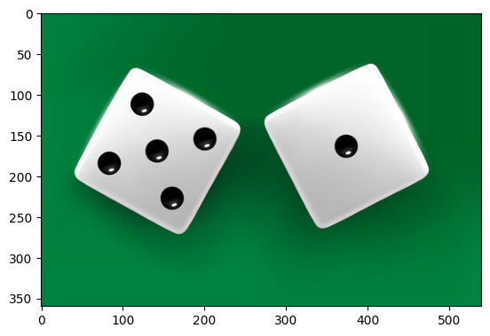

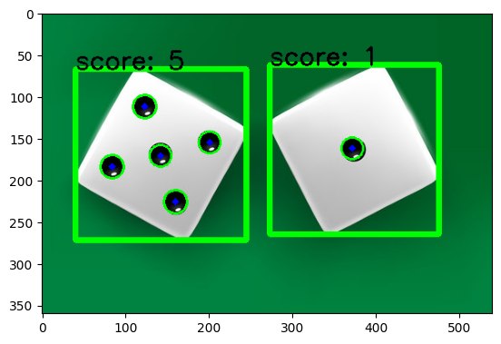